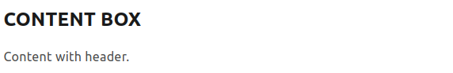
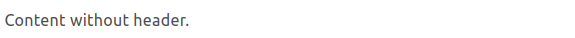

## $ whoami

Hi! My name is Aman Sharma and I welcome you to my
[share of the internet](https://algomaster99.github.io/). I created this
website to showcase my frontend skills and I really wanted to feel productive
during COVID-19 lockdown :sweat_smile:.

## $ uname

Built using [TypeScript](https://www.typescriptlang.org/) and
[React](https://reactjs.org/) library and
[indented SASS](https://sass-lang.com/documentation/syntax#the-indented-syntax)
is used for styling React components.

The development and production processes are automated through
[Webpack](https://webpack.js.org/).

[ESLint](https://eslint.org/) and [stylelint](https://stylelint.io/) are used to
stick to the code formatting guidelines.

## $ cat credits

Thank you
[Vineet Arora](https://dribbble.com/vineetarora 'Designer at ClearTrip') for
spending time to design this and guiding me through the development process!

## $ make

1. Clone the repository using `https://github.com/algomaster99/portfolio.git`
   or `git@github.com:algomaster99/portfolio.git`.

2. Run `npm install` to install all dependencies for the application.

3. Run `npm start` to start the development server at `http://localhost:3000`.

4. You may use `npm run code-format` and `npm run style-format` to format the
   TypeScript and SASS code respectively.

5. Run `npm run build` to build the static page for deployment.

## $ chown <your name> portfolio

If you like the portfolio, please give it a :star: and if you want to copy it,
please feel free to do so. I will list down the steps for the same.

1. Fork the repository in yout GitHub account. This will make a copy of my
   repository and you will be able to edit it.

2. Edit the constants in [consts.d.ts](src/consts.d.ts) according to your
   profile.

3. If you are changing the variable names, please change it in the
   corresponding file where it is used. You can simply `grep` over the whole
   codebase or if you are using VSCode, they have a good search functionality.

4. If you want to add more content, use the component
   [`ContentBox`](src/components/content-box/index.tsx). It takes in to props -
   `header` and `content`. `header` is optional whereas the content in necessary.
   Look at some examples below:

```jsx
<ContentBox header="content box" content="Content with header." />
```

The above block will render the following:



```jsx
<ContentBox content="Content without header." />
```

The above block will render the following:



5. Change content in meta tags in [index.html](index.html) so that search
   engines know that it is your website. Feel free to add configuration for your
   preferred search engines. Please make a PR if you feel like :smile:.

6. Replace `me.jpeg` in `src/assets/` with your photo (preferably squared) with
   your photo. Make sure to rename it as `me.jpeg` only.

7. Replace your résumé with `resume.pdf` in `src/assets/` and make sure to
   rename it to `resume.pdf`.

8. If you would like to add your preferred tech-stack icons', please find their
   SVGs online and add it to `src/assets/icon/` directory. After that, open the
   svg image in the code editor and give it an id attribute `tech` and then simply
   import the icon in `src/components/skills/index.tsx`. Finally, append it to the
   `LOGOS` array.

9. Obviously, you are not restricted to the above edits. Feel free to fiddle
   around with code and add or remove features and make it personalized. If you
   think, you can add a great feature in the application, don't hesitate to send a
   pull request or even opening an issue. I will be happy to review it :relieved:.
